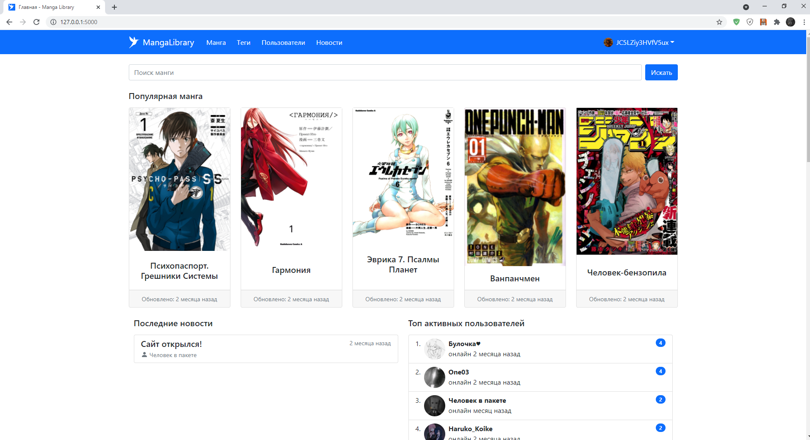
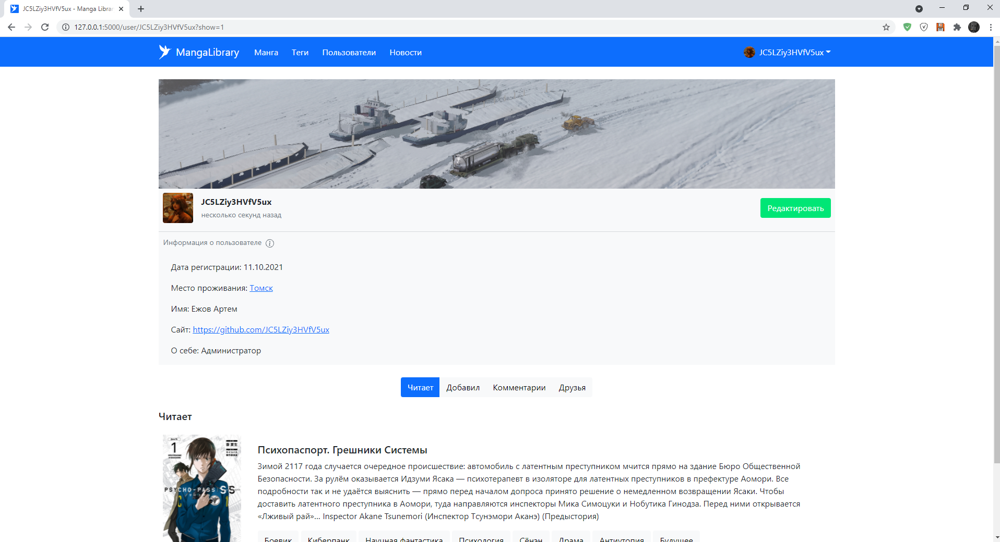
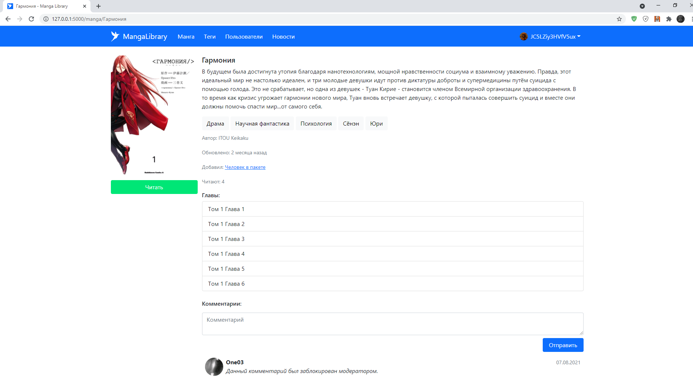

# MangaLibrary

Simple manga (Japanese Comic) reader application written on flask with SQLite database.

## Features

- user profile, manga commenting, subscription on user / manga
- add manga, add chapter, update manga, tags
- post news
- user rating
- administrator moderate comments

## Installation

```bash
git clone https://github.com/JC5LZiy3HVfV5ux/MangaLibrary.git
cd MangaLibrary
python3 -m venv env
source env/bin/activate
pip install -r requirements.txt
export FLASK_APP=run.py
```

## Create databases

```bash
python3 db_create.py
```

## Bootstrap

Download Bootstrap 5 and add folders in app/static/js/bootstrap/, app/static/css/bootstrap/

## Run application 

```bash
flask run
```

## Celery & RabbitMQ

Tasks:
  * task.email.change_email
  * task.email.confirm
  * task.email.password_reset

Run worker for queue email 
```bash
celery -A worker.celery worker --loglevel=INFO -Q email
```

Run Flower for worker
```bash
celery -A worker.celery flower
```

Run RabbitMQ server
```bash
sudo rabbitmq-server start -detached
```

## Testing

Run unittest:

```bash
flask test
```

Run unittest using test_names:

```bash
flask test tests.test_basics   
```

Obtaining code coverage reports:

```bash
flask test --coverage
```

## Screenshots
<details><summary>Open</summary>
Index page:



User profile:



Manga page:



Chapter page:


</details>
